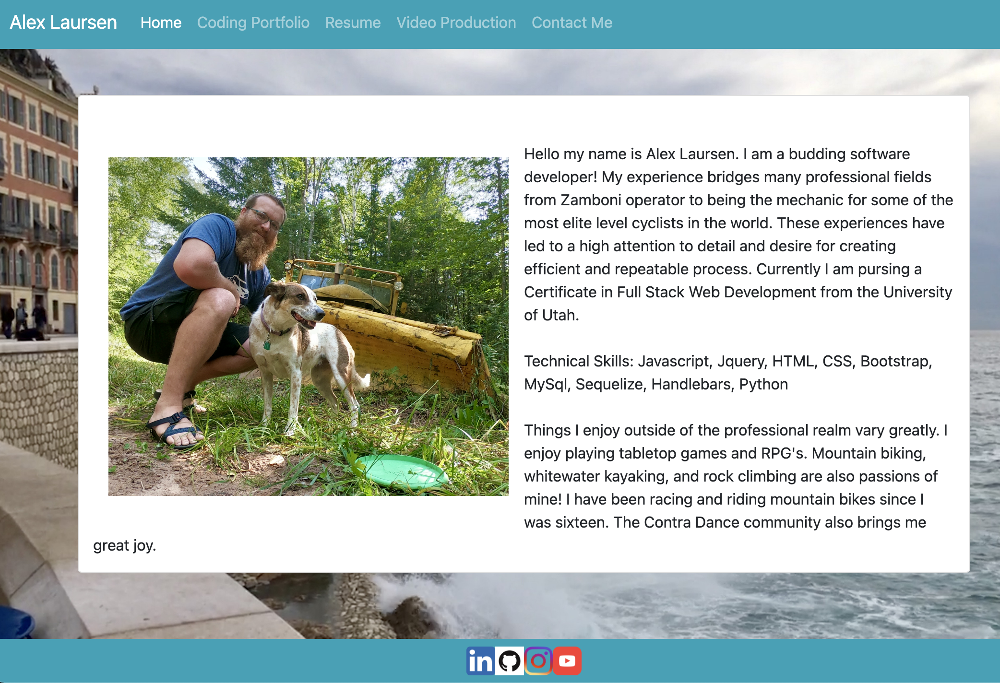

# ajlaursen portfolio

* homework 2 UofU bootcamp

* Live Site: https://ajlaursen.github.io/ajlaursen-portfolio/

* Repo: https://github.com/ajlaursen/ajlaursen-portfolio

* These HTML files are the beginnings of a new portfolio page

* These files contain A home page, portfolio page, and a contact page

* The portfolio page is built so that it is easy to add new items as well as show off the responsive layout. The portfolio page is infinitely expandable to add as many projects as needed.

* technologies used: HTML, Bootstrap, JS, CSS

* Contact: Alex Laursen - Ajlaursen@aol.com

* License: [License](LICENSE)